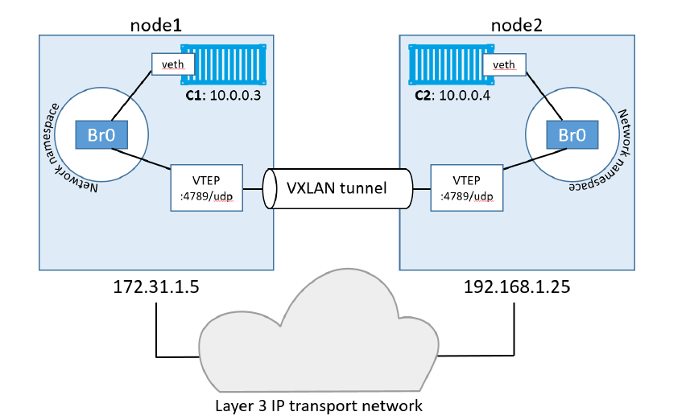
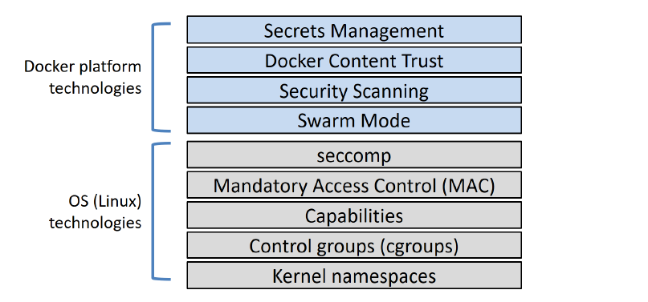

### Goals

- The trainee will understand docker internals

  

### Tasks

- Read the following book: [Docker Deep Dive](https://drive.google.com/drive/folders/1wuXO4WNv3jLHv3TMkZeNBpErAr7lTd4y)

  **Do NOT read the following chapters:**
  - Docker swarm
  - Deploying apps with docker stacks
  - Tools for the enterprise
  - Enterprise-grade features
  - Appendix B, and C

 **Answer the following questions while reading the book:**

  Pay attantion the questions are not in the exact order. You should continue reading and only if you finished the book search the missing answers. 
  Are all questions answered? You are ready to go :wink: :sparkles:

 **Containers from 30,000 feet**
  - How would companies deliver apps before containers and VMs?
  - What are containers?
  - What are the differences between containers and VMs?
  - What are self-healing containers with restart policies? (References: always, unless-stopped, on-failed)
  - When does a container stop running?
    
 **Docker Engine**
  - What is the docker engine and what are the major components that make up the docker engine?
  - Explain what each component is responsible for.
  - What are the benefits of the new modular docker engine model?
  - How are containers able to run without the daemon?                   (References: runc process, STDIN & STDOUT streams)
  - Explain the whole process of how a container is created from the moment we enter a command in the CLI.

 **Images & Builds**
  - What are images and what are they made up of?
  - How can you push an image to a 3rd party registry? What if the registry's certificate expired? 
  - Explain image sharing.
  - An image in production was accidentally tagged with the same tag as an older image, how can we still differentiate between the two? (Hint: The image content is different)
  -  What are Multi-architecture images? (References: mafinests lists, manifests)
  - What is a dockerfile? give an example of instructions that do not add layers to the image. 
  - What are Multi-stage builds? Why do we need them? What do we learn from it about the way we work with containers and images?
  - What is image squashing? what functionality do we lose when we squash an image?
  - What is docker compose?

**Networking**
  - What is libnetwork and the CNM?
  - Explain the following terms:
    - Sandbox, Endpoint, Network
  - Explain Single-host bridge networks. (References: docker0)
  - How can I access a container's port 5000 from my docker host on port 80?
  - How can containers connect to existing physical networks or VLANs without port mappings?
  - Why cant we use MACVLAN in public cloud platforms?
  - What is service discovery?
  - What are docker overlay networks? How are they different from single-host networks?
  - Explain the following process if C1 wants to send a message to C2: 
  

  (References: VNID Encapsulation & Decapsulation, VXLAN, VTEP, default br0 bridge)
 
 **Volumes and persistent data**
   - How is non persistent data stored in containers?
   - How can we store persistent data?
   - What is a major concern with external storage systems shared volumes?

**Security**
- Explain each of the following technologies in detail (without MAC and Swarm mode)
 

- How do namespaces help us create isolated environments? What are containers REALLY now that you learned this?
- Why would we need to limit containers OS resources usage?

**Summary questions**
  - How will you troubleshoot a failed container?
  - Using what command can we view details of images or containers?
  - If containers are more efficient than VMs, why do we still sometimes use VMs and containers on top of them?
  - How can we detach from a container without exiting?

  **More knowledge!**   
  - Read a bit about CRI-O and rkt
  - How does the Open Container Initiative help us swap out container runtimes? Briefly read the following: [Dont Panic! K8s drops Docker](https://kubernetes.io/blog/2020/12/02/dont-panic-kubernetes-and-docker/)

:fire: :cloud: :fire: :cloud:
Written by Danko 
:cloud: :fire: :cloud: :fire:
